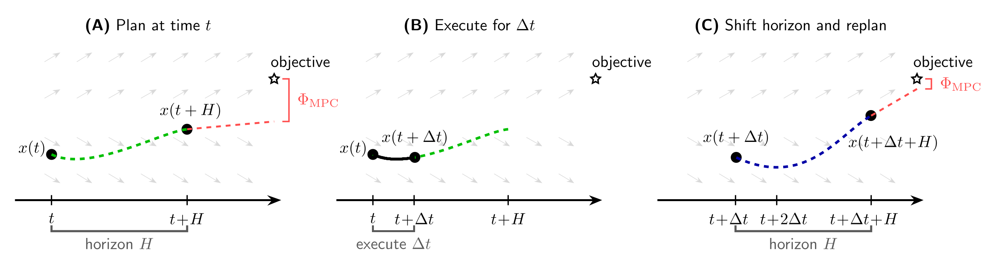
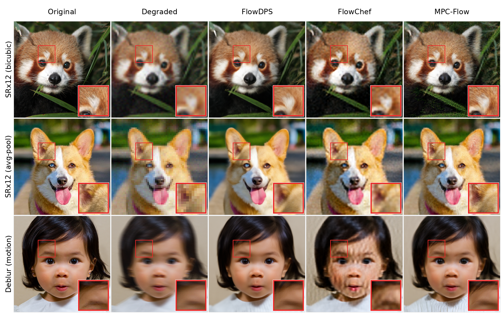

# [ICML 2026] MPC-Flow: Solving Inverse Problems with Flow-based Models via Model Predictive Control



## Abstract

MPC-Flow is a training-free inference-time control method for solving inverse problems with flow-based generative models.

The method treats the flow trajectory as a controlled dynamical system and applies model predictive control (MPC) during sampling. This allows task losses to guide generation while explicitly regularising deviations from the original generative trajectory.

The large-scale image experiments in this repository use FLUX.2 [dev] as the flow-based prior. The public code includes demos for style transfer, luminance-constrained colorization, and super-resolution.



## Quick Start

### Repository Layout

- [`FLUX2/`](FLUX2/): main FLUX.2 experiments and public demos.
- [`2DHexagon/`](2DHexagon/): lightweight 2D flow-matching and MPC toy experiment.

The FLUX.2 folder is the main entry point for reproducing the image inverse-problem demos.

### Environment Setup

Create the tested conda environment from the FLUX.2 folder:

```powershell
cd FLUX2
conda env create -f environment.yml
conda activate mpcflow
python -c "import flux2.mpc; print('FLUX2 imports ok')"
```

Install the Jupyter kernel if you want to run the notebooks:

```powershell
python -m ipykernel install --user --name mpcflow --display-name "mpcflow"
```

The tested setup uses CUDA-enabled PyTorch with FLUX.2 Diffusers:

```text
torch==2.10.0+cu128
torchvision==0.25.0+cu128
diffusers==0.37.0
transformers==5.3.0
bitsandbytes==0.49.2
```

Tested GPUs:

- NVIDIA RTX 3090 24GB (note: if generation does not fit in VRAM, reduce image sizes)
- NVIDIA RTX 5090 32GB

CPU-only FLUX.2 execution is not a supported target.

### FLUX.2 Weights

The paper experiments used the 4-bit Diffusers model:

```text
diffusers/FLUX.2-dev-bnb-4bit
```

Request access on Hugging Face and authenticate if loading from the Hub:

```powershell
hf auth login
```

If the model is already downloaded locally, pass the local snapshot path as `--repo-id`.

## Examples

Run all commands from `FLUX2/`.

**Example 1. Prompt-only FLUX.2 generation**

```powershell
python cli_mpc_flow.py `
  --prompt "a cat sitting on a windowsill at sunset" `
  --reward none `
  --height 448 `
  --width 448 `
  --steps 28 `
  --guidance-scale 4.0 `
  --seed 42 `
  --save-dir output/demos/prompt_only `
  --out prompt_only.png
```

**Example 2. Style transfer with MPC-Flow**

```powershell
python cli_mpc_flow.py `
  --prompt "a cat" `
  --reward style `
  --style-image style_images/xingkong.jpg `
  --method mpc `
  --opt-steps 20 `
  --mpc-lr 0.5 `
  --mpc-rho 64.0 `
  --height 448 `
  --width 448 `
  --steps 28 `
  --guidance-scale 4.0 `
  --seed 42 `
  --save-dir output/demos/style_transfer `
  --out style_transfer_mpc.png
```

**Example 3. Luminance-constrained colorization**

```powershell
python cli_mpc_flow.py `
  --prompt "colorize this luminance image" `
  --reward luminance `
  --reward-image prompt_images/dog.jpg `
  --image prompt_images/dog.jpg `
  --method mpc `
  --opt-steps 20 `
  --mpc-lr 0.2 `
  --mpc-rho 1e-6 `
  --height 256 `
  --width 256 `
  --steps 28 `
  --guidance-scale 4.0 `
  --seed 42 `
  --save-dir output/demos/luminance `
  --out luminance_mpc.png
```

**Example 4. Super-resolution**

```powershell
python cli_mpc_flow.py `
  --prompt "produce a very high-quality photorealistic sharp image, that is consistent with this low-resolution image" `
  --reward superres `
  --reward-image prompt_images/house_image.jpg `
  --image prompt_images/house_image.jpg `
  --superres-lr-size 128 200 `
  --method mpc `
  --opt-steps 20 `
  --mpc-lr 0.5 `
  --mpc-rho 2.5e-6 `
  --height 512 `
  --width 800 `
  --steps 28 `
  --guidance-scale 4.0 `
  --seed 42 `
  --save-dir output/demos/superres `
  --out superres_mpc.png
```

The same demos are available as notebooks:

- [`FLUX2/style_transfer_demo.ipynb`](FLUX2/style_transfer_demo.ipynb)
- [`FLUX2/colorize_luminance_demo.ipynb`](FLUX2/colorize_luminance_demo.ipynb)
- [`FLUX2/superres_mpc_demo.ipynb`](FLUX2/superres_mpc_demo.ipynb)

## How to Choose Task and Solver

Use `--reward` to choose the inverse-problem objective:

- `none`: prompt-only FLUX.2 generation.
- `style`: style transfer using CLIP Gram-matrix style features.
- `luminance`: colorization constrained by input luminance.
- `superres`: super-resolution from a low-resolution reference.

Use `--method` to choose the correction rule:

- `mpc`: MPC-Flow, the method proposed in the paper.
- `flowchef`: FlowChef-style latent correction baseline.

For MPC-Flow, `--mpc-rho` controls the strength of the trajectory/control regularisation. FlowChef ignores `--mpc-rho`.

## Paper Sweep

The public release includes the style-transfer trade-off sweep used for the paper figures:

```powershell
cd FLUX2
python sweep_mpc.py --config sweeps/sweep_mpc_flowchef.json --dry-run
```

The full sweep expands to 900 FLUX.2 runs and is not intended as a quick demo. See [`FLUX2/sweeps/README.md`](FLUX2/sweeps/README.md).

## Paper

- arXiv: https://arxiv.org/abs/2601.23231
- Status: accepted to ICML 2026

Authors:
George Webber\*<sup>1</sup>, Alexander Denker\*<sup>2</sup>, Riccardo Barbano<sup>3</sup>, and Andrew J. Reader<sup>1</sup>

1. School of Biomedical Engineering and Imaging Sciences, King's College London
2. Helmholtz Imaging, Deutsches Elektronen-Synchrotron DESY, Germany
3. Department of Computer Science, University College London

\* Equal contribution.

## Citation

```bibtex
@article{webber2026solving,
  title={Solving Inverse Problems with Flow-based Models via Model Predictive Control},
  author={Webber, George and Denker, Alexander and Barbano, Riccardo and Reader, Andrew J},
  journal={arXiv preprint arXiv:2601.23231},
  year={2026}
}
```

## License

Repository code license: [`LICENSE.md`](LICENSE.md).

FLUX.2 model weights are not redistributed in this repository. FLUX.2 model use is governed separately by [`FLUX2/model_licenses/LICENSE-FLUX-DEV`](FLUX2/model_licenses/LICENSE-FLUX-DEV).

The FLUX.2 code path builds on upstream FLUX/Diffusers code, but [`FLUX2/cli_mpc_flow.py`](FLUX2/cli_mpc_flow.py) is a modified MPC-Flow research runner, not the upstream FLUX CLI.
